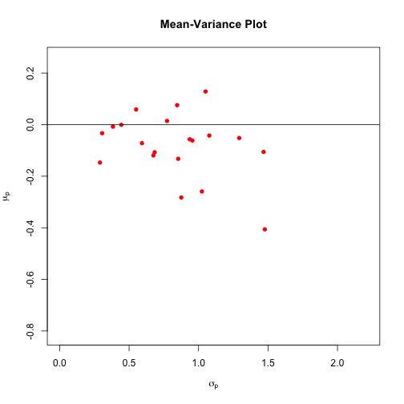
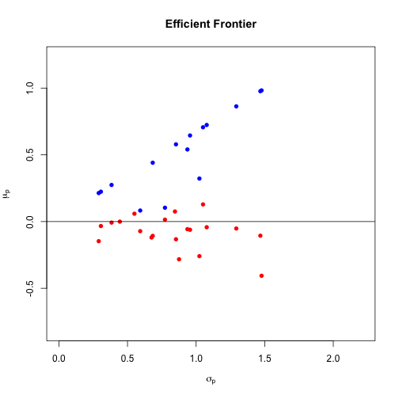
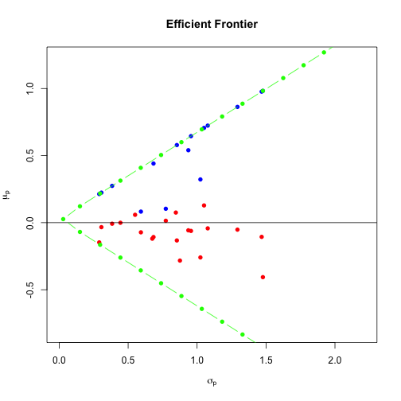
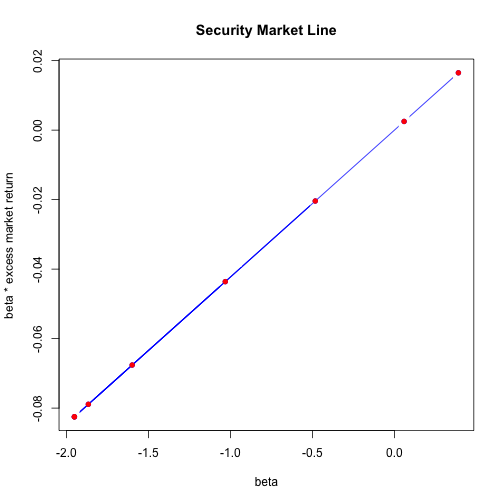

# Coursera: Financial Engineering II: In-class Exercises in R


```r
    options(width=100)
```

## Lesson 1.1: Mean Variance Overview


```r
    asset.names <- c("US Bonds",
                     "Int’l Bonds",
                     "US Large Growth",
                     "US Large Value",
                     "US Small Growth",
                     "US Small Value",
                     "Int’l Dev. Equity",
                     "Int’l Emerg. Equity" )

    mu.vec <- c( 3.1500000,
                 1.75000000,
                 -6.39000000,
                 -2.86000000,
                 -6.75000000,
                 -0.54000000,
                 -6.75000000,
                 -5.26000000 ) / 100

    names(mu.vec) <- asset.names
    d <- length(asset.names)            # number of assets

    #
    # covariance matrix 
    #
    Sigma.mat <- matrix(c(0.0010050, 0.00132800, -0.00057900, -0.00067500, 0.00012100, 0.00012800, -0.00044500, -0.00043700,
                          0.0013280, 0.00727700, -0.00130700, -0.00061000, -0.00223700, -0.00098900, 0.00144200, -0.00153500,
                          -0.0005790, -0.00130700, 0.05985200, 0.02758800, 0.06349700, 0.02303600, 0.03296700, 0.04803900,
                          -0.0006750, -0.00061000, 0.02758800, 0.02960900, 0.02657200, 0.02146500, 0.02069700, 0.02985400,
                          0.0001210, -0.00223700, 0.06349700, 0.02657200, 0.10248800, 0.04274400, 0.03994300, 0.06599400,
                          0.0001280, -0.00098900, 0.02303600, 0.02146500, 0.04274400, 0.03205600, 0.01988100, 0.03223500,
                          -0.0004450, 0.00144200, 0.03296700, 0.02069700, 0.03994300, 0.01988100, 0.02835500, 0.03506400,
                          -0.0004370, -0.00153500, 0.04803900, 0.02985400, 0.06599400, 0.03223500, 0.03506400, 0.07995800),
                        nrow=d,
                        ncol=d,
                        byrow=T)
    rownames(Sigma.mat) <- asset.names
    colnames(Sigma.mat) <- asset.names
```

### Computing mean return and variance of return for random portfolio


```r
    #
    # randomly assigned weights (from excel worksheet)
    #
    x.vec <- c(0.794, 1.424, -1.44, 0.892, 1.03, -0.95, 0.95, -1.70)
    names(x.vec) <- asset.names

    #
    # weights should sum to 1
    #
    sum(x.vec)
```

```
## [1] 1
```

```r
    #
    # Portfolio mean and variance
    # Note: slightly different than in-class example due to precision
    #
    mu.p <- t(x.vec) %*% mu.vec
    mu.p
```

```
##           [,1]
## [1,] 0.0773358
```

```r
    sigma.p <- sqrt( t(x.vec) %*% Sigma.mat %*% x.vec )
    sigma.p
```

```
##           [,1]
## [1,] 0.4435025
```

### Generate mean-variance plot for random portfolios


```r
    #
    # Generate a bunch of random portfolios and plot them.
    # Each column of x.mat is a random set of portfolio weights.
    # 
    set.seed(1234)
    k <- 20
    x.mat <- sapply( 1:k, 
                     function(c) {
                         x.vec <- c( runif(d-1,-2,2), 0)
                         x.vec[d] <- 1 - sum(x.vec)
                         x.vec
                     })
    x.mat
```

```
##            [,1]        [,2]       [,3]       [,4]        [,5]       [,6]         [,7]        [,8]
## [1,] -1.5451864 -1.06979798 -0.8307366 -0.7892265  1.32538019  1.0386825 -0.752702772  1.06183915
## [2,]  0.4891976  0.66433503  1.3491825 -1.3638160 -1.81691895 -1.1950078  0.487276793 -1.70488048
## [3,]  0.4370989  0.05700457 -0.8551069 -1.8400163 -0.17563407 -0.9647607 -0.680919297 -0.76125359
## [4,]  0.4935178  0.77436517 -0.9327169 -1.1248018 -0.93925331  1.9686017  0.007989892  0.86908697
## [5,]  1.4436615  0.17989934 -1.2531088  1.2423942 -0.78131119  1.2294094  0.708378109  0.01818365
## [6,]  0.5612424 -0.86906567 -1.0710964  0.1027902  0.02922748  0.2133344 -0.060035043 -1.38800416
## [7,] -1.9620170  1.69373394 -0.7335502  1.6586327 -1.27561517  0.5856244 -1.024284691  0.01573395
## [8,]  1.0824851 -0.43047440  5.3271332  3.1140436  4.63412502 -1.8758837  2.314297009  2.88929451
##             [,9]       [,10]       [,11]      [,12]      [,13]       [,14]      [,15]      [,16]
## [1,] -0.02415631 -1.94500024 -1.51407925 -1.7197900 -1.2153014  1.60169838 -0.7614103 -0.6972723
## [2,]  1.00480079 -1.04389709  1.57134553 -0.7174223  1.5943220 -1.46368722  0.9684786 -1.3797521
## [3,] -1.30140070  0.82597847 -1.94149098  0.6739816 -0.4420009 -1.47354346 -1.8581731 -1.4801514
## [4,]  1.39356964 -0.76762097  1.13248441  1.7056019 -0.7565169 -1.57884999  0.2603044 -0.2578758
## [5,]  1.45933533  0.03419026 -1.64015467 -0.1123611 -1.3598853  0.04633432 -0.8789689 -1.8454294
## [6,] -1.83257090 -1.79341352  0.07675992 -1.4295386  1.5847434 -0.79920378 -1.1832147  0.8532063
## [7,] -0.73127138  0.25827936 -0.46293325  0.1770790 -1.3344249 -1.89313242 -1.4650444 -1.5969238
## [8,]  1.03169353  5.43148374  3.77806828  2.4224496  2.9290640  6.56038417  5.9180283  7.4041986
##           [,17]       [,18]       [,19]      [,20]
## [1,]  1.8012198  1.18864184 -0.99381720 -0.3078120
## [2,] -1.5127289  0.97710886  0.01302068  1.6572676
## [3,] -1.1213735  1.66389690 -0.01213531 -0.1288307
## [4,]  1.6523511  1.97839298 -0.72621676  1.6326766
## [5,]  1.7834125  1.76944286  1.84889131  0.3909731
## [6,] -0.8833751 -0.05545837  0.53639747  0.5269713
## [7,] -1.5061156 -0.86616183 -1.49026641  1.4766333
## [8,]  0.7866099 -5.65586323  1.82412621 -4.2478792
```

```r
    #
    # Columns (portfolio weights) should sum to 1.
    #
    colSums(x.mat)
```

```
##  [1] 1 1 1 1 1 1 1 1 1 1 1 1 1 1 1 1 1 1 1 1
```

```r
    #
    # t(x.mat) %*% mu.vec 
    #   
    # returns a vector where each entry is the mean return
    # for the portfolio with the corresponding weights in x.mat
    #
    mu.p.vec <- t(x.mat) %*% mu.vec

    #
    # Loop thru x.mat and compute the variance for each col-vector
    # of portfolio weights.
    #
    sigma.p.vec <- apply(x.mat,
                         2,
                         function(x.vec) { sqrt(t(x.vec) %*% Sigma.mat %*% x.vec) })

    #
    # Plot the random portfolios
    # 
    plot(x=sigma.p.vec,
         y=mu.p.vec,
         # type="b", 
         pch=16, 
         main="Mean-Variance Plot",
         col="red",
         ylim=c(min(mu.p.vec)*2, max(mu.p.vec)*2),
         xlim=c(0, max(sigma.p.vec)*1.5), 
         xlab=expression(sigma[p]), 
         ylab=expression(mu[p]))
    abline(h=0)
```



### Use optimization (solver) to compute efficient frontier


```r
    library(Rsolnp)

    #
    # ----- solnp: Parameters
    #
    #     pars: The starting parameter vector.
    # 
    #      fun: The main function which takes as first argument the parameter
    #           vector and returns a single value.
    # 
    #    eqfun: (Optional) The equality constraint function returning the
    #           vector of evaluated equality constraints.
    # 
    #      eqB: (Optional) The equality constraints.
    # 
    #  ineqfun: (Optional) The inequality constraint function returning the
    #           vector of evaluated inequality constraints.
    # 
    #   ineqLB: (Optional) The lower bound of the inequality constraints.
    # 
    #   ineqUB: (Optional) The upper bound of the inequality constraints.
    # 
    #       LB: (Optional) The lower bound on the parameters.
    # 
    #       UB: (Optional) The upper bound on the parameters.
    # 
    #
    # -----  Return Value: List containing the following values:
    #
    #     pars: Optimal Parameters.
    # 
    # convergence : Indicates whether the solver has converged (0) or not (1
    #           or 2).
    # 
    #   values: Vector of function values during optimization with last one
    #           the value at the optimal.
    # 
    # lagrange: The vector of Lagrange multipliers.
    # 
    #  hessian: The Hessian of the augmented problem at the optimal solution.
    # 
    #   ineqx0: The estimated optimal inequality vector of slack variables
    #           used for transforming the inequality into an equality
    #           constraint.
    # 
    # nfuneval: The number of function evaluations.
    # 
    #  elapsed: Time taken to compute solution.
    #

    #
    # Use solnp to compute the efficient portfolio for every sigma.p
    # for the random portfolios we generated above
    #
    optimizationFn <- function(i) {
        # x.vec <- x.mat[,i]
        x.vec <- rep(1/d,d)
        sigma.p <- sigma.p.vec[i]

        sol <- solnp( pars=x.vec,
                      fun=function(x.vec) { -1 * t(x.vec) %*% mu.vec },     # (-1) because solnp minimizes this function
                      eqfun=function(x.vec) { sum(x.vec) },
                      eqB=c(1),
                      ineqfun=function(x.vec) { sqrt( t(x.vec) %*% Sigma.mat %*% x.vec ) },
                      ineqUB=sigma.p,
                      ineqLB=sigma.p-0.001,
                      control=list(trace=0))
        # warnings()

        x.eff.vec <- sol$pars
        mu.eff <- t(x.eff.vec) %*% mu.vec
        sigma.eff <- sqrt( t(x.eff.vec) %*% Sigma.mat %*% x.eff.vec )
        list(mu=mu.eff, sigma=sigma.eff, sol=sol)
    }

    mu.eff.p.vec <- rep(0,k)
    sigma.eff.p.vec <- rep(0,k)

    # for some reason sapply hangs
    # sapply( 1:k, optimizationFn)      
    for (i in 1:k) {

        l <- optimizationFn(i)
        mu.eff.p.vec[i] <- l$mu
        sigma.eff.p.vec[i] <- l$sigma
    }
```

And now plot the efficient frontier:


```r
    #
    # why the fltr?  cuz sometimes solnp doesn't converge, which
    # ends up producing wild results.  Just ignore those.
    #
    fltr <- abs( sigma.eff.p.vec - sigma.p.vec ) < 0.01
    mu.eff.p.vec <- mu.eff.p.vec[fltr]
    sigma.eff.p.vec <- sigma.eff.p.vec[fltr]

    #
    # Plot the random portfolios
    # 
    plot(x=sigma.p.vec,
         y=mu.p.vec,
         pch=16, 
         main="Efficient Frontier",
         col="red",
         ylim=c(min(mu.p.vec)*2, max(mu.eff.p.vec)*1.25),
         xlim=c(0, max(sigma.p.vec)*1.5), 
         xlab=expression(sigma[p]), 
         ylab=expression(mu[p]))
    abline(h=0)

    #
    # Now plot the efficient frontier
    #
    points(x=sigma.eff.p.vec,
           y=mu.eff.p.vec,
           pch=16,
           col="blue")
```




### Solve for efficient frontier analytically 


```r
    source("fin-eng-2.R")

    #
    # Global minimum variance portfolio: portfolio that has
    # the minimum variance (risk).
    #
    gmv.weights.vec <- meanVarGetMinVarPortfolio( mu.vec, Sigma.mat )

    #
    # Need a 2nd portfolio along the efficient frontier.
    # The two-fund theorem tells us that every efficient portfolio is a linear
    # combination of any two other efficient portfolios.
    #
    eff.weights.vec <- meanVarGetEfficientPortfolio( mu.vec, Sigma.mat, target.return=max(mu.eff.p.vec) )

    #
    # Use the two efficient portfolios to build the efficient frontier
    #
    eff.weights.mat <- meanVarBuildEfficientFrontier(mu.vec, 
                                                     Sigma.mat, 
                                                     alpha.vec=seq(from=-1,to=2,by=0.1), 
                                                     gmv.portfolio.weights=gmv.weights.vec, 
                                                     eff.portfolio.weights=eff.weights.vec) 

    eff.frontier.means <- apply(eff.weights.mat,
                                2,
                                function(x.vec) { t(x.vec) %*% mu.vec })

    eff.frontier.sigmas <- apply(eff.weights.mat,
                                 2,
                                 function(x.vec) { sqrt(t(x.vec) %*% Sigma.mat %*% x.vec) })

    #
    # Plot the random portfolios
    # 
    plot(x=sigma.p.vec,
         y=mu.p.vec,
         pch=16, 
         main="Efficient Frontier",
         col="red",
         ylim=c(min(mu.p.vec)*2, max(mu.eff.p.vec)*1.25),
         xlim=c(0, max(sigma.p.vec)*1.5), 
         xlab=expression(sigma[p]), 
         ylab=expression(mu[p]))
    abline(h=0)

    #
    # Plot the efficient frontier as computed by solver.
    #
    points(x=sigma.eff.p.vec,
           y=mu.eff.p.vec,
           pch=16,
           col="blue")

    #
    # Plot the efficient frontier as computed analytically.
    #
    points(x=eff.frontier.sigmas,
           y=eff.frontier.means,
           type="b",
           pch=16,
           col="green")
```




## Lesson 1.3 Sharpe Optimal Portfolio and the Risk-Free Frontier

### Sharpe Optimal Portfolio (aka Tangency Portfolio)


```r
    rf <- 1.5 / 100

    sharpe.optimal.weights <- meanVarGetTangencyPortfolio( mu.vec = mu.vec,
                                                           Sigma.mat = Sigma.mat,
                                                           risk.free.rate = rf )

    sharpe.optimal.port <- calcPortfolioMeanVarReturn( weights.vec = sharpe.optimal.weights,
                                                       mu.vec = mu.vec,
                                                       Sigma.mat = Sigma.mat )

    sharpe.optimal.port$sharpe.ratio <- (sharpe.optimal.port$expected.return - rf) / sharpe.optimal.port$stdev.return

    sharpe.optimal.port$weights
```

```
##            US Bonds         Int’l Bonds     US Large Growth      US Large Value     US Small Growth 
##          1.24605858         -0.11436670          0.12225143         -0.05317533         -0.10285739 
##      US Small Value   Int’l Dev. Equity Int’l Emerg. Equity 
##          0.19524158         -0.33557277          0.04242060
```

```r
    cbind(sharpe.optimal.port)
```

```
##                 sharpe.optimal.port
## weights         Numeric,8          
## expected.return 0.05726678         
## stdev.return    0.05564743         
## sharpe.ratio    0.7595461
```

### Security Market Line


```r
    #
    # Multiply the portfolio weights by the covariances of each asset with all
    # other assets (the rows of Sigma.mat).  Then divide by the variance of the 
    # market (where the market portfolio is the sharpe optimal portfolio).
    #
    beta.vec <- Sigma.mat %*% sharpe.optimal.port$weights / sharpe.optimal.port$stdev.return^2

    #
    # Plot the security market line
    # The security market line is the relationship between beta and market excess returns
    # 
    plot(x=beta.vec,
         y=beta.vec * (sharpe.optimal.port$expected.return - rf),
         pch=16, 
         type="b",
         main="Security Market Line",
         col="blue",
         # ylim=c(min(mu.p.vec)*2, max(mu.eff.p.vec)*1.25),
         # xlim=c(0, max(sigma.p.vec)*1.5), 
         xlab="beta", 
         ylab="beta * excess market return")

    #
    # Now plot the actual excess returns for each asset
    #
    points(x=beta.vec,
           y=mu.vec - rf,
           pch=16,
           col="red")
```




